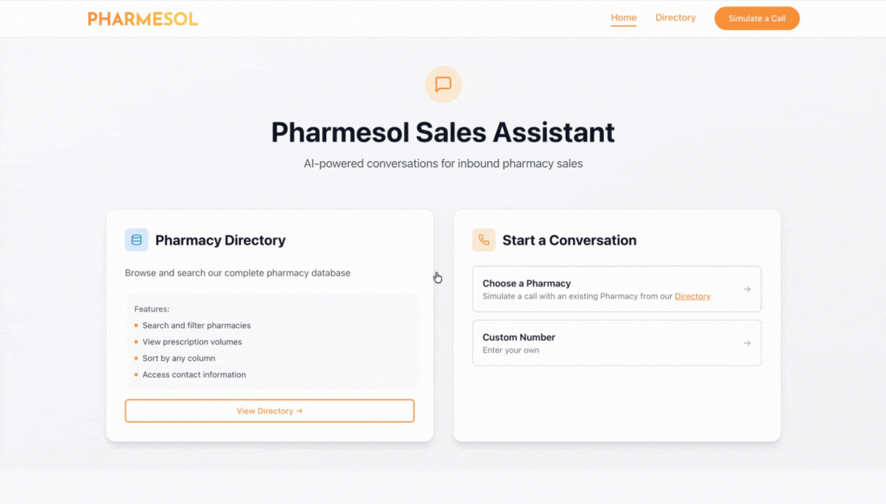
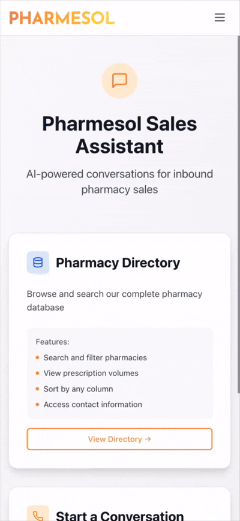

# Pharmesol Pharmacy Sales Chatbot

An intelligent inbound sales chatbot for pharmacies, powered by OpenAI's GPT-4 with function calling capabilities. Built with NestJS, React, PostgreSQL, and MikroORM.

## 📱 Application Overview

<table>
<tr>
<td width="70%">

### Desktop


</td>
<td width="30%">

### Mobile


</td>
</tr>
</table>

## 🎯 Features

- **Intelligent Phone Number Recognition**: Identifies returning pharmacies via caller ID lookup
- **External API Integration**: Fetches pharmacy details from MockAPI
- **AI-Powered Conversations**: Uses OpenAI function calling for structured interactions
- **Lead Collection**: Automatically collects information from new pharmacy leads
- **Follow-up Actions**: Schedule callbacks and send follow-up emails (mocked)
- **Volume-Based Personalization**: Tailors messaging based on prescription volume
- **State Machine**: Event-driven conversation flow management
- **Persistent Storage**: PostgreSQL database with MikroORM for conversation history
- **Modern React UI**: Clean, responsive interface with real-time chat

## 🏗️ Architecture Highlights

### Key Differentiators

1. **State Machine Pattern**: Event-driven conversation state management
   ```
   INITIAL_GREETING → [PHARMACY_FOUND] → PHARMACY_IDENTIFIED
                    ↓ [PHARMACY_NOT_FOUND]
                    → COLLECTING_LEAD_INFO → [INFO_COLLECTED] → DISCUSSING_SERVICES
   ```
   Provides clear conversation flow control, easy debugging, and scalable multi-step interactions.

2. **Persistent Database (PostgreSQL + MikroORM)**:
   - **Lead Collection**: Gracefully stores new pharmacy lead information in the database
   - **Dual Lead Handling**: Manages both new leads AND existing pharmacies from external API
   - **Conversation Context**: Retrieves previous conversation history for the same phone number
   - **Analytics & Insights**: Enables future analysis of conversation patterns and conversion metrics
   - **Audit Trail**: Complete history of all interactions for compliance and quality assurance

3. **OpenAI Function Calling**: Structured outputs for precise, type-safe actions

4. **Type-Safe**: Full TypeScript implementation across frontend and backend

### Tech Stack

**Backend:**
- NestJS 10
- MikroORM 6 with PostgreSQL
- OpenAI API (GPT-4 with function calling)
- TypeScript 5
- Class Validator for DTOs

**Frontend:**
- React 18 with TypeScript
- Axios for API communication
- Custom hooks for state management
- CSS with modern styling

**Infrastructure:**
- Docker & Docker Compose
- PostgreSQL 16

## 📦 Project Structure

```
pharmacy-sales-chatbot/
├── backend/
│   ├── src/
│   │   ├── database/
│   │   │   └── entities/          # MikroORM entities
│   │   ├── modules/
│   │   │   ├── chatbot/           # Main chatbot logic
│   │   │   ├── pharmacy/          # External API integration
│   │   │   ├── ai/                # OpenAI service with functions
│   │   │   └── notifications/     # Email & callback services
│   │   ├── mikro-orm.config.ts
│   │   └── main.ts
│   └── package.json
├── frontend/
│   ├── src/
│   │   ├── components/            # React components
│   │   ├── hooks/                 # Custom hooks
│   │   ├── services/              # API client
│   │   └── types/                 # TypeScript interfaces
│   └── package.json
├── docker-compose.yml
└── README.md
```

## 🚀 Getting Started

### Quick Start (5 minutes)

```bash
# 1. Set up environment
cp .env.example .env
# Edit .env and add your OpenAI API key

# 2. Run setup script (installs everything and starts services)
./setup.sh

# 3. Open the app
# Frontend: http://localhost:3000
# Backend: http://localhost:3001
```

**That's it!** The setup script handles:
- Installing all dependencies
- Starting PostgreSQL, backend, and frontend with Docker
- Running database migrations
- Setting up the environment

### Need More Details?

📖 **See [SETUP.md](./SETUP.md)** for:
- Detailed step-by-step instructions
- Running without Docker
- Database management and migrations
- Troubleshooting common issues
- Development workflow and tips

## 🧪 Testing the Chatbot

### Test Phone Numbers

The application includes test pharmacy data from the MockAPI:

1. **Returning Pharmacy**: `+1-555-123-4567`
   - Recognizes existing pharmacy
   - Shows pharmacy details
   - References Rx volume in conversation

2. **New Lead**: Any other phone number
   - Collects pharmacy information
   - Saves lead to database
   - Guides through information collection

### Conversation Flow Examples

**Returning Pharmacy:**
```
Bot: Hello! This is Pharmesol calling for John at HealthFirst Pharmacy...
User: Hi, I'm interested in your inventory management system
Bot: [Discusses solutions based on their Rx volume]
User: Can you send me more information?
Bot: [Uses function calling to offer email/callback]
```

**New Lead:**
```
Bot: Hello! Thank you for calling Pharmesol. Could you tell me the name of your pharmacy?
User: Sure, it's City Pharmacy
Bot: [Collects info using AI function calling]
Bot: [Offers follow-up options once info is collected]
```

## 🔬 API Endpoints

### Start Chat
```http
POST /api/chatbot/start
Content-Type: application/json

{
  "phoneNumber": "+1-555-123-4567"
}
```

### Send Message
```http
POST /api/chatbot/message
Content-Type: application/json

{
  "conversationId": 1,
  "message": "I'm interested in your services"
}
```

### Schedule Callback
```http
POST /api/chatbot/schedule-callback
Content-Type: application/json

{
  "conversationId": 1,
  "preferredTime": "Tomorrow at 2pm",
  "notes": "Discuss pricing"
}
```

### Send Email
```http
POST /api/chatbot/send-email
Content-Type: application/json

{
  "conversationId": 1,
  "email": "pharmacy@example.com",
  "includePricing": true
}
```

## 🧩 Key Implementation Details

### 1. OpenAI Function Calling

The AI service uses structured function calling for precise actions:

```typescript
{
  name: 'collect_pharmacy_info',
  description: 'Collect information from new pharmacy lead',
  parameters: {
    pharmacy_name: string,
    contact_person: string,
    email: string,
    estimated_rx_volume: number
  }
}
```

Benefits:
- Type-safe AI responses
- Clear separation between conversation and actions
- Easy to test and extend

### 2. Conversation State Machine

Event-driven state transitions:

```
INITIAL_GREETING → [PHARMACY_FOUND] → PHARMACY_IDENTIFIED
                 ↓ [PHARMACY_NOT_FOUND]
                 → COLLECTING_LEAD_INFO → [INFO_COLLECTED] → DISCUSSING_SERVICES
                                                            ↓ [FOLLOWUP_REQUESTED]
                                                            → SCHEDULING_FOLLOWUP → COMPLETED
```

### 3. Database Entities

**Conversation**: Tracks call sessions with state and pharmacy data
**Message**: Individual chat messages with metadata
**PharmacyLead**: New leads collected through conversations

### 4. Pharmacy API Integration

- Normalizes phone numbers for flexible matching
- Calculates monthly Rx volume from daily prescriptions
- Volume-based tier messaging (HIGH/MEDIUM/LOW)

## 📝 Testing Strategy

### Unit Tests
```bash
cd backend
npm test
```

### Test Coverage Areas

1. **Unit Tests**
   - Pharmacy service phone normalization
   - State machine transitions
   - AI function execution
   - Volume tier calculations

2. **Integration Tests**
   - Full conversation flows
   - Database persistence
   - API endpoint validation

3. **Edge Cases**
   - Invalid phone formats
   - API timeouts and failures
   - Malformed responses
   - SQL injection attempts
   - XSS in messages
   - Very long messages
   - Concurrent conversations

## 🚢 Deployment & Monitoring

### Q: How would you deploy this LLM response generation component over AWS?

**A:** For deploying this application on AWS, I'd use SST (Serverless Stack) v3 for infrastructure as code. The backend would run on AWS Lambda with the NestJS application wrapped using the serverless-express adapter, which converts the Express-based NestJS app into a Lambda-compatible handler. Lambda automatically scales based on incoming requests without manual configuration. The database would be Aurora Serverless v2 PostgreSQL. The React frontend would be deployed as a static site using SST's StaticSite component, which handles the build process and serves the files through S3 and CloudFront as a CDN for fast global delivery. Sensitive information like the OpenAI API key would be stored in AWS Secrets Manager. The entire infrastructure is defined in TypeScript through SST, making it easy to manage separate environments for development, staging, and production. Deployment is straightforward with npm commands, and I'd set up GitHub Actions for CI/CD to automatically run tests, execute database migrations, and deploy on successful builds.

**See `DEPLOYMENT.md` for detailed instructions.**

### Q: How would you monitor and evaluate its performance when it's in production?

**A:** Monitoring would focus on three main areas. First, application performance using CloudWatch and potentially DataDog to track response times (P50, P95, P99), error rates, and throughput metrics like conversations per hour. Second, LLM-specific metrics including token usage to track costs, function calling accuracy to ensure the AI is properly executing actions, and conversation quality metrics like completion rates and lead information completeness. Third, business metrics such as pharmacy recognition rates and conversion rates for email and callback requests. I'd implement structured logging with Winston to capture detailed conversation metadata and use AWS X-Ray for distributed tracing to identify bottlenecks. Alerting through PagerDuty or Slack would notify the team of critical issues like high OpenAI error rates or database problems. For quality assurance, I'd run daily synthetic tests simulating conversations and conduct weekly manual reviews of random conversation samples to check for tone, accuracy, and any hallucinations. Cost monitoring through AWS Cost Explorer and OpenAI usage dashboards would help track spending trends and optimize token usage over time.

## 🎓 Technical Decisions

### Why PostgreSQL + MikroORM?
- ACID compliance for conversation history
- MikroORM provides type-safe database queries
- Easy migrations and schema management

### Why OpenAI Function Calling?
- Structured, type-safe responses
- Clear separation between conversation and actions
- Better error handling than text parsing
- Easier to test and maintain

### Why State Machine Pattern?
- Explicit conversation flow management
- Easy to visualize and debug
- Scalable for complex multi-step flows
- Clear audit trail of state transitions

## 📚 Additional Notes

### Architectural Highlights

This solution demonstrates production-ready patterns:

1. **PostgreSQL persistence** for conversation history and analytics
2. **OpenAI function calling** for structured, type-safe AI interactions
3. **State machine pattern** for explicit conversation flow management
4. **Comprehensive testing** with real database integration
5. **SST deployment** for Infrastructure as Code on AWS

### Security Considerations

- Phone number masking in logs (PII protection)
- Input validation with class-validator
- SQL injection prevention via ORM
- XSS protection in message rendering
- Rate limiting (should add in production)

### Scalability Considerations

- Database connection pooling
- API response caching
- Stateless design (horizontal scaling)
- Async processing for notifications
- Read replicas for analytics

## 📄 License

MIT